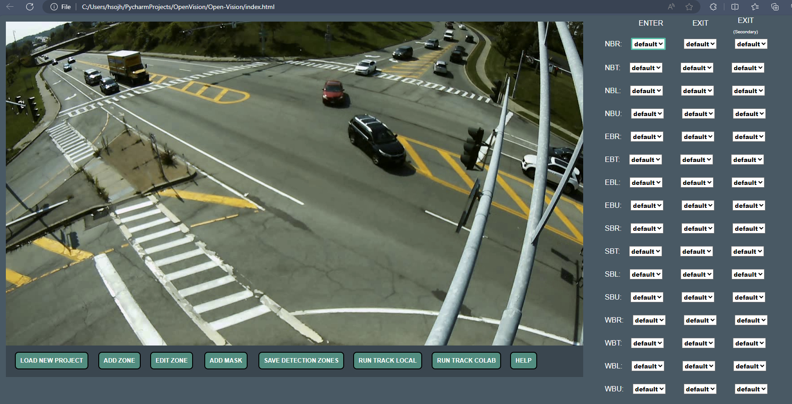

<p align="center">
  
</p>

<div align="center">
<p>
  
</p>
<br>  
<div>---------------- OpenVision Web Application ------------------------------------ Tracker Output ------------------ </div>
<br>  
<a href=""></a>
</div>

</div>


_This repository is a work in progress_

OpenVision is the Framework for processing video from the [OpenVision Traffic Camera](https://github.com/joshkuminski/OpenVision-Traffic-Camera) module.

# OpenVision
Object Detection and Tracking for Traffic Counts and Analytics.

This repository leverages the powerful capabilities of the [Yolov7_StrongSORT_OSNet](https://github.com/mikel-brostrom/Yolov7_StrongSORT_OSNet) 
framework. Included in this project is an intuitive web application that enables users to effortlessly define  vehicle
movements and conduct traffic studies. A simple algorithm is employed to count vehicles in 15-minute intervals, while 
object detection is achieved through the use of [Yolov7](https://github.com/WongKinYiu/yolov7) and 
tracking is implemented using [StongSORT](https://github.com/dyhBUPT/StrongSORT), a method that integrates both motion 
and appearance information based on [OSNet](https://github.com/KaiyangZhou/deep-person-reid). As a result, this approach 
offers increased accuracy, particularly in scenarios involving occlusions, though it does come at the expense of 
processing time. It is advisable to employ GPU acceleration for this project due to its approximately 15-fold increase 
in speed compared to CPU-only processing.

# Background
A Turning Movement Count, is commonly used in traffic engineering to model intersections and optimize signal timing.

# Instructions
## Prerequisites for GPU
For More detailed instructions see [NVIDIA Docs](https://docs.nvidia.com/deeplearning/cudnn/install-guide/index.html#install-windows)
1. NVIDIA CUDA Toolkit: [CUDA(v11.3)](https://developer.nvidia.com/cuda-11.3.0-download-archive)
2. NVIDIA Graphic Driver for your GPU.[NVIDIA Drivers](https://www.nvidia.com/Download/index.aspx?lang=en-us)
3. cuDNN:[cuDNN](https://developer.nvidia.com/cudnn), Need to be registered for the NVIDIA Developer Program.
   - This project has only been tested with cuDNN v8.3.2 and Cuda v11.3. If you use a different version, update requirements_gpu.txt.

## 1. Clone this repo
```bash
git clone https://github.com/joshkuminski/OpenVision.git
```
or                                                                                                                                    
download the .zip file 

## 2. Install requirements
### Windows
****If you do not have a gpu and want to run this in the cloud skip down to Step 3 - Cloud.****
This utilizes Google Colaboratory- an online platform for *free* access to a gpu

Run the 'install.cmd' file as *Administrator* located in the root directory
   This will install the submodules for this project along with, Python 3.8.10, and Git. It will also create a virtual 
   environment and install project requirements.txt
* If you have a supported NVIDIA GPU, also run the 'install_gpu.cmd' file. This will install requirements_gpu.txt
### Apple macOS
Not tested.

## 3. Load Video Files
### Local
If you are going to run the tracker on your local machine, place the video files you wish to analyze in the directory 
./Open-Vision/video. Then run the 'Set_Img.bat' file as *Administrator* located in the root directory. This will create an image 
for the video you uploaded in case the video dosen't want to load during zone definition process.

### Cloud
If you wish to run the tracker on a cloud GPU using Google Colab, upload the video files to your Google Drive in a 
directory called Open-Vision/video.

## 4. Run the Web Application
Open the file 'index.html' located in the Open-Vision directory. (Tested on Microsoft Edge, Google Chrome, and Firefox).
Following the instructions on the Help page for directions on how to use. This will walk you through the steps to define 
the zones in order to get Turning Movement Counts.

## 5. Run the Tracker
Run the 'OV-track.bat' file as *Administrator* located in the root directory
  This will run the tracker.
  
# Custom Dataset
Custom weight files can be created using [OpenVision-Label]()

# Contact 
For questions please email joshuakuminski.github@gmail.com
For bugs and feature requests please visit [GitHub Issues](https://github.com/joshkuminski/OpenVision/issues).

